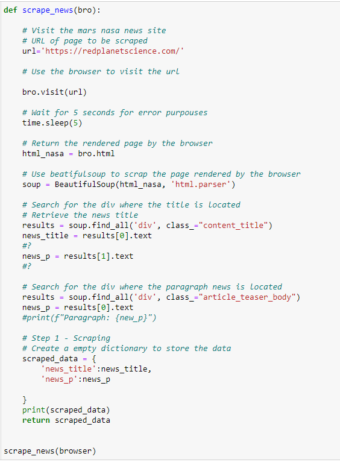
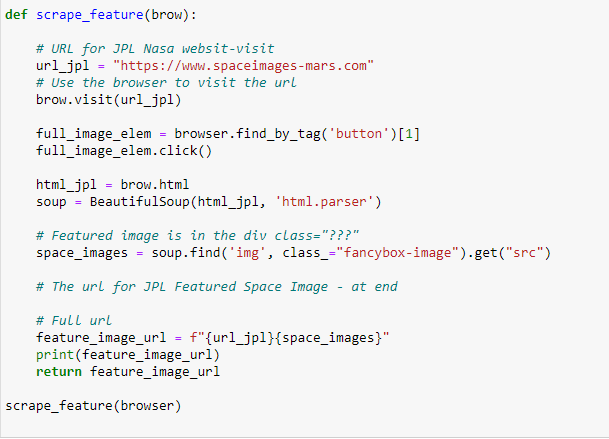
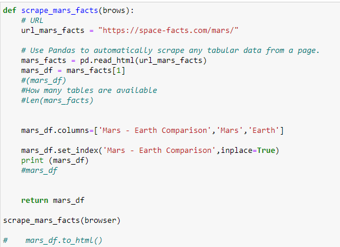
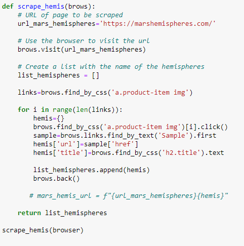

# Mission to Mars

This assignment aimed to learn web scraping to extract information from the NASA Science Mars Exploration website. Using the Chrome Developer tool to identify HTML components, Beautiful Soup/Splinter to automate a web browser and perform the scrape, MongoDB for storing data, and Flask for creating the web application for displaying the data. This scrape lesson collected the following planet information:

The following steps is used in order to complete this task:

## Scraping

The initial scraping uses Jupyter Notebook, Beautiful Soup, Panda, and Requests/Splinter.

### NASA Mars News

url=https://redplanetscience.com/ website was used to get the latest news on Mars mission using BeautifulSoup, splinter, pandas in a jupyter notebook.

### JPL Mars Space Images - Featured Image

https://www.spaceimages-mars.com was used to scrape the featured image of mars in full resolution.
Use splinter to navigate the site and find the image url for current Feature Mars Image and assign the url string to a variable.

### Mars Facts

https://space-facts.com/mars/ was used to obtain the table containing facts about the planet, including Diameter, Mass, etc.

### Mars Hemispheres

https://marshemispheres.com/ was used to obtain high-resolution images for each of Mar's hemispheres.

## Flask

- A python script to run all of the scraping code was designed ,and all of the scraped data was put into one Python dictionary.

- '/scrape' route, which will import the Python script and call the scrape function, was created.

## HTML file

Finally a HTML file called 'index.html' was created that displayed all of the data in HTML elements.

